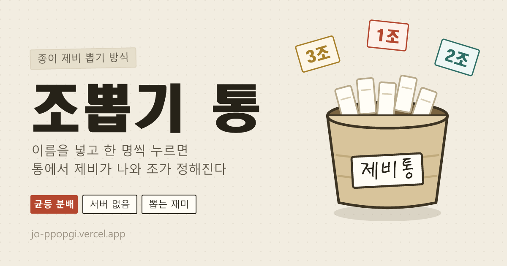

# 조뽑기 통 (jo-ppopgi)

**종이에 1·2·3·4 를 적어 통에 넣고 한 명씩 뽑던 그 방식 그대로의 조 나누기.**
이름을 넣고 사람을 누르면 통이 흔들리고, 접힌 제비가 올라오고, 펼쳐지면서 조가 정해진다.


## 🔗 라이브 데모

**https://jo-ppopgi.vercel.app**

## 🎲 왜 '랜덤 배정' 이 아니라 '제비' 인가

버튼 한 번에 명단이 좌르륵 나오는 조 나누기는 이미 많다. 그런데 실제로 모임에서 하던 방식은 그게 아니었다.
**1~4 를 사람 수만큼 종이에 적어 통에 넣고, 한 명씩 뽑는다.** 이 방식에는 결과 리스트가 못 주는 게 두 개 있다.

| | 흔한 랜덤 배정 | 제비뽑기 (이 앱) |
|---|---|---|
| 결과 | 버튼 한 번에 전부 확정 | **한 명씩** 자기 손으로 뽑아 공개 |
| 조 인원 | 운에 따라 6명 vs 1명도 가능 | 제비를 인원수만큼 만들어 넣으므로 **저절로 균등** |
| 후반 | 볼 것 없음 | 남은 제비가 줄며 **답이 좁혀지는 긴장감** |
| 뒷맛 | "프로그램이 정했네" | "내가 뽑았네" |

11명을 4조로 나누면 제비는 3·3·3·2 로 만들어지고, 한 장 적은 조는 **무작위로** 정해진다.
그래서 공평함은 계산이 보장하고, 재미는 뽑는 순간이 만든다.

## ✨ 주요 기능

- 🪣 **통에서 뽑는 연출** — 대기 명단에서 사람을 클릭 → 통 흔들림 → 접힌 제비가 올라옴 → 펼쳐지며 조 공개. 종이 부스럭 소리까지 (WebAudio 합성, 오디오 파일 0개).
- ⚖️ **인원 자동 균등** — 인원수만큼 제비를 만들어 조에 고르게 배분. 나머지 한 장씩만 무작위 조가 가져간다.
- 🙈 **답을 흘리지 않는 자리 표시** — 13명 4조처럼 딱 떨어지지 않으면 **네 조 모두 4자리**로 열어 둔다. 실제 제비는 한 조만 4장이지만, 그게 어느 조인지는 그 제비가 뽑히는 순간에 드러난다. (인원이 같은 조는 언제나 같은 자리 수를 보이도록 계산 — 표시로 역산이 안 된다)
- 😬 **줄어드는 통** — 남은 제비 수가 계속 보인다. 후반으로 갈수록 남은 자리가 좁혀지며 판이 조여든다.
- 🖐️ **다 뽑은 뒤 밸런스 조정** — 이름표를 **끌어서** 다른 조로 이동, **사람 위에 놓으면** 둘이 자리 교환. 마우스·터치 모두 지원하고, 누른 뒤 목적지를 누르는 방식도 된다(키보드 가능).
- 🤚 **아무나 한 명 뽑기** — 진행자가 순서 고민 안 하도록 안 뽑은 사람 중 무작위 지목 후 바로 뽑기.
- ↩️ **되돌리기** — 방금 뽑은 제비를 통에 도로 넣고 다시 섞는다.
- 🐢 **지각생 합류** — 뽑는 도중 사람이 늘면, 아직 여유 있는 조의 제비를 한 장 만들어 통 아무 데나 끼워 넣는다. 손으로 조를 옮긴 뒤에도 **현재 배치 기준**으로 계산한다.
- 📋 **결과 복사** — 커뮤니티에 그대로 붙여넣는 텍스트로 클립보드에 담는다.
- 💾 **이어하기** — 새로고침해도 진행 중인 판이 살아 있다 (localStorage).
- 📝 **명단 붙여넣기** — 쉼표·줄바꿈 섞인 명단을 통째로 넣어도 중복·공백을 정리해 받는다. 조는 2~10개, 이름 편집 자유.
- ♿ **모션·소리 배려** — `prefers-reduced-motion` 이면 연출을 즉시 건너뛰고, 소리는 토글로 끈다.

## 🛠 기술 스택

| 영역 | 선택 |
|------|------|
| 프레임워크 | Next.js 16 (App Router) + React 19 + TypeScript |
| 스타일 | Tailwind CSS 4 (`@theme` 토큰) — 갱지 톤 단일 라이트 룩 |
| 뽑기 규칙 | 순수 함수 (`lib/draw.ts`) — 제비 생성·균등 분배·Fisher–Yates 셔플, 난수는 `crypto.getRandomValues` |
| 상태 | `useReducer` + localStorage 지속 (`lib/store.ts`) |
| 드래그 | Pointer Events 직접 구현 — 마우스·터치 한 코드, `elementFromPoint` 히트테스트 |
| 효과음 | WebAudio 실시간 합성 (`lib/sound.ts`) — 종이 부스럭 = 노이즈 + 밴드패스 |
| 그래픽 | 통·제비 전부 인라인 SVG, 이미지 에셋 없음 |
| 서버/DB | **없음** — 명단은 서버로 전송되지 않는다 |
| 배포 | Vercel |

## 🚀 로컬 실행

```bash
npm install
npm run dev   # http://localhost:3000
```

## 🧪 검증

뽑기 규칙은 UI 없이 리듀서만 노드에서 돌려 확인했다.

- 12명 4조 → 3·3·3·3 / 11명 4조 → 3·3·3·2 / 3명 5조 → 빈 조 허용
- 되돌리기 시 제비가 통으로 복귀 · 지각생 합류 후 13명 → 4·3·3·3
- 손으로 조를 옮긴 뒤 지각생을 넣어도 가장 빈 조로 배정
- 자리 교환은 인원 유지, 같은 조끼리는 무시
- 13명 4조에서 **빈 자리 표시로 '4명이 될 조' 를 역산할 수 없음** (인원이 같은 조는 표시도 동일)
- **2000회 반복 시 특정인의 조 분포 편차 6%p 미만** · 500회 반복 시 4명 자리를 네 조가 고르게 차지

## 📁 구조

```
app/page.tsx        뽑기 흐름 오케스트레이션 · 결과 복사 · 축포
lib/draw.ts         제비 생성/셔플/균등 분배 — 규칙의 전부가 여기 있다
lib/store.ts        useReducer 상태 + localStorage
lib/sound.ts        WebAudio 합성 효과음
lib/palette.ts      조 색 10종
components/         BucketArt(통 SVG) · DrawOverlay(뽑기 연출) · GroupBoard(드래그 보드)
                    WaitingList · SetupPanel · Confetti
docs/PROJECT.md     기획·규칙 정리
```

커뮤니티(brag.io.kr) 공유용 사이드 앱. 배포는 side-app 작업공간에서 `bash scripts/deploy.sh jo-ppopgi`.
